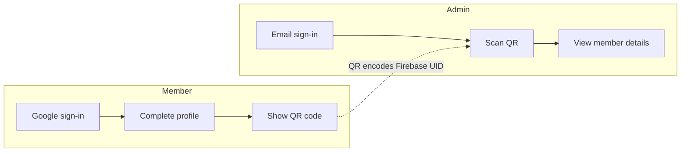
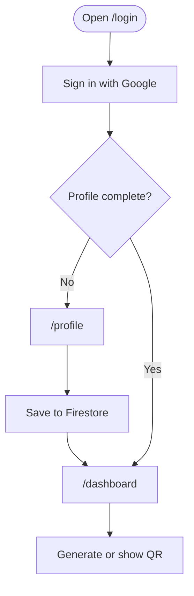
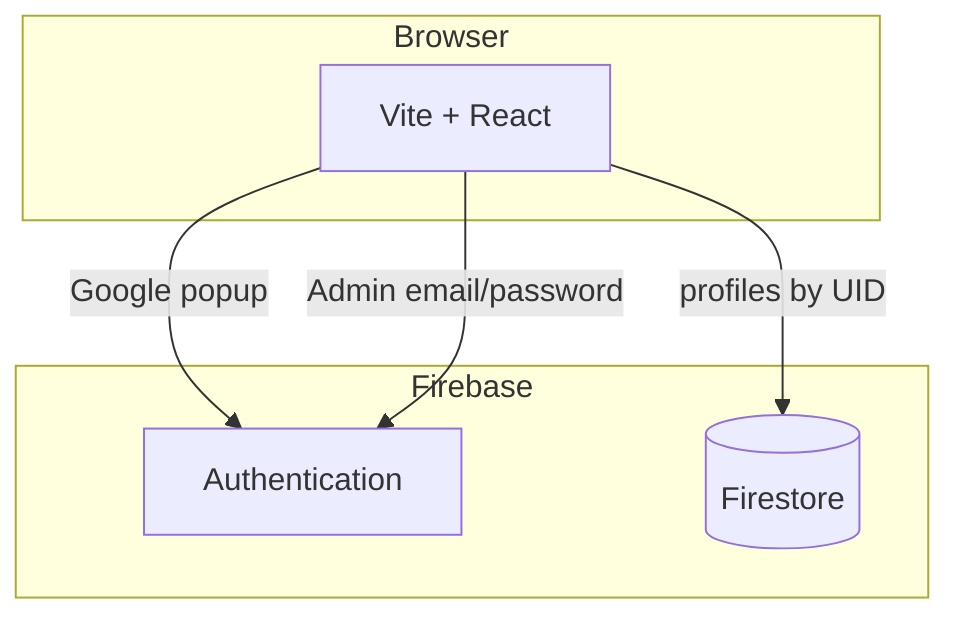

# QR App

A React + Firebase web app for member identification. Members sign in with Google, complete a profile, and get a personal QR code. Admins scan that code to look up the member in Firestore.

The display name in the header and browser tab comes from `VITE_APP_NAME`.

## How it works



### Member flow



### Admin scan

```mermaid
sequenceDiagram
  actor Admin
  participant Scanner as "/admin"
  participant Firestore
  participant Details as "/user-details"

  Admin->>Scanner: Sign in with email
  Admin->>Scanner: Point camera at QR
  Scanner->>Scanner: Read UID from QR
  Scanner->>Firestore: Get profile by UID
  Firestore-->>Scanner: Name, email, phone, address
  Scanner->>Details: Show member card
```

### Architecture



Profiles live in the collection named by `VITE_USERS_COLLECTION`, one document per Firebase UID. QR images are generated in the browser and cached in `localStorage`.

## Routes

| Path | Who | Screen |
| --- | --- | --- |
| `/` or `/login` | Member | Google sign-in |
| `/profile` | Member | One-time profile setup |
| `/dashboard` | Member | QR code |
| `/admin-login` | Admin | Email and password |
| `/admin` | Admin | Camera QR scanner |
| `/user-details` | Admin | Scanned member |

## Setup

1. Copy the env template and fill in Firebase values from **Project settings → General → Your apps**:

   ```bash
   cp .env.sample .env
   ```

2. Enable **Google** sign-in in Firebase **Authentication → Sign-in method**. Create an admin user (email/password) for `/admin-login`.

3. Create a Firestore database and allow authenticated users to read/write their own profile. Full steps and example rules: [FIREBASE_SETUP.md](./FIREBASE_SETUP.md).

4. Install and run:

   ```bash
   npm install
   npm run dev
   ```

   The app listens on port `5173`.

```bash
npm run build    # production build
npm run preview  # serve the build locally
```

## Environment variables

Copy from `.env.sample`. Restart the Vite server after any change.

| Variable | Purpose |
| --- | --- |
| `VITE_APP_NAME` | Brand name in the header and tab |
| `VITE_FIREBASE_API_KEY` | Firebase web API key (`AIza…`, no `your-` prefix) |
| `VITE_FIREBASE_AUTH_DOMAIN` | Usually `your-project-id.firebaseapp.com` |
| `VITE_FIREBASE_PROJECT_ID` | Project ID only, not the storage URL |
| `VITE_FIREBASE_STORAGE_BUCKET` | Storage bucket |
| `VITE_FIREBASE_MESSAGING_SENDER_ID` | Sender ID |
| `VITE_FIREBASE_APP_ID` | Web app ID |
| `VITE_USERS_COLLECTION` | Firestore collection for profiles |

Do not commit `.env`. Admin access is currently the email list in `src/config/adminConfig.ts`.

## Access from another hostname

Vite only allows listed hosts. `vite.config.ts` already includes `kyboat-server` and `*.ts.net`. Add any other hostname there, then restart Vite.

For Google sign-in, also add that **hostname** (no `https://`, no port) under Firebase **Authentication → Settings → Authorized domains**. Example: `kyboat-server.tailxxxx.ts.net`.

If the Google popup still fails, add the full origin (including `https://` and `:5173`) as an **Authorized JavaScript origin** on the Firebase OAuth web client in Google Cloud Console.

## Project layout

```
src/
  components/   Screens: login, profile, dashboard, scanner, member details
  config/       Firebase, app name, Firestore collection, admin emails
  contexts/     Auth state
  services/     Profile and QR helpers
```

## Troubleshooting

| Error | What to check |
| --- | --- |
| `auth/api-key-not-valid` | API key in `.env` must start with `AIza`, not `your-AIza`. Restart Vite. |
| `auth/unauthorized-domain` | Add the hostname you are using to Firebase authorized domains. |
| Host is not allowed | Add it to `server.allowedHosts` in `vite.config.ts`. |
| Missing or insufficient permissions | Firestore rules must allow the signed-in user to write their profile document. |

More Firebase detail is in [FIREBASE_SETUP.md](./FIREBASE_SETUP.md).
